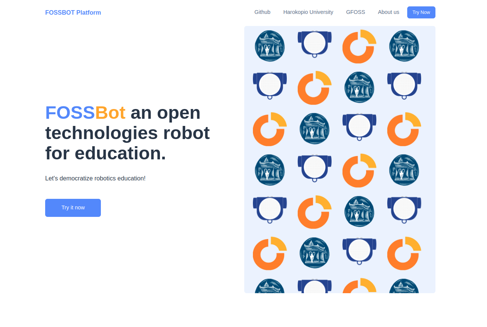
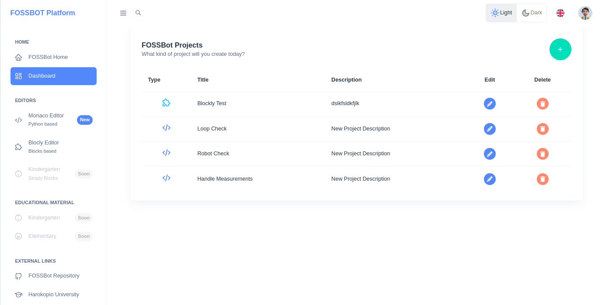
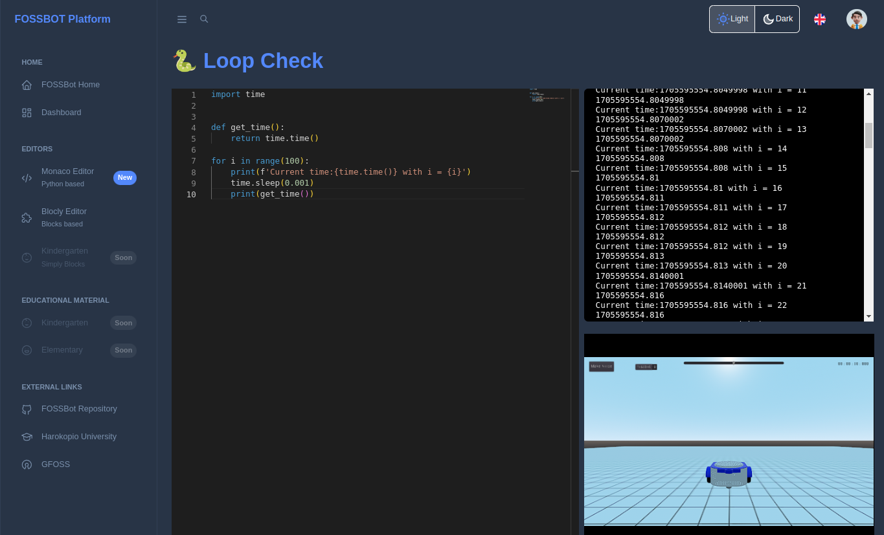

## Fossbot Platform


## General Information
The FOSSBot Platform is a open-source project combining a DIY educational robot with an open source online simulation environment made in Godot. Key features include an interactive online coding environment, even without the physical robot. The platform supports both a custom block-based visual editor and a Python IDE, utilizing modern technologies like PostgreSQL, Docker, React, and FastAPI for a seamless experience. It's designed to be lightweight and user-friendly, suitable for schools with limited internet resources. Future updates will introduce collaborative features and compatibility with devices like Arduino and MicroPython-enabled microcontrollers.

* React Front-end
* Python Back-end using FastAPI
* PostgreSQL
* Docker
* Godot FOSSBot Simulator
* WebGL and WASM

## Screenshots



### Blockly IDE
...
### Monaco (native Python) IDE





### Usage

Backend servers
```
cd back-end
docker build -t fsbt-back .
cd ..
cd simulator
docker build -t fsbt-sim .
cd ..
docker-compose up 
```

Backend servers (2nd way)
The first time you have to create the network: 
```
docker network create fossbot-net
```

```
docker-compose -f docker-compose-dev.yml up --build
```
or just to run the docker containers: 
```
docker-compose -f docker-compose-dev.yml up 
```

Front-end server
```
cd front-end
npm install
npm run dev
```

Test database 
username : test1
password : 123456

## Software Development Team
* Christos Chronis
* Eleftheria Papageorgiou
* Dimitris Charitos
* Manousos Linardakis